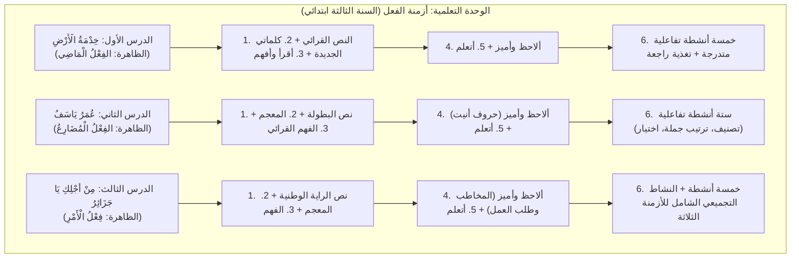
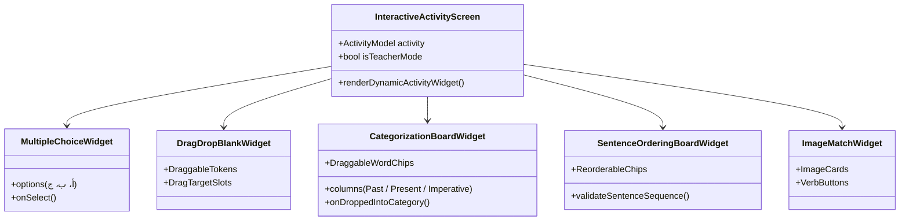
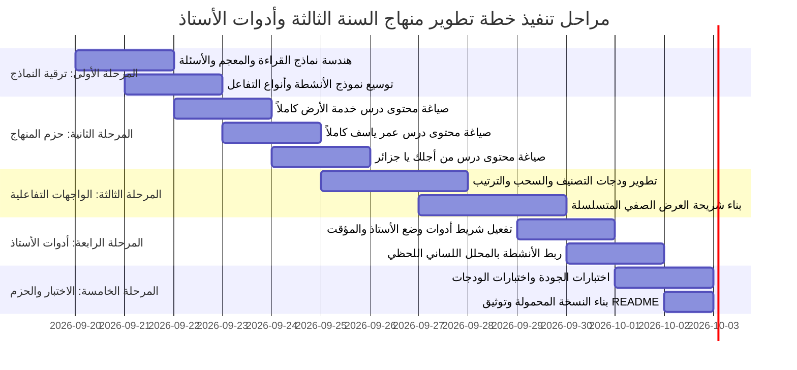

# خُطَّةُ التَّطْوِيرِ الشَّامِلَةِ لِمَنْظُومَةِ «بُسْتَانِ النَّحْوِ العَرَبِيِّ»
## استناداً إلى المنهاج البيداغوجي لدروس السنة الثالثة ابتدائي وتطويع التطبيق لخدمة «الأستاذ» في قاعة العرض (Data Show)

---

## 📌 الفهرس التنفيذي
1. [المقدمة والرؤية الاستراتيجية (فهم سياق الأستاذ والملف المدرسي)](#1-المقدمة-والرؤية-الاستراتيجية)
2. [التحليل البيداغوجي التفصيلي لمحتوى ملف الوورد (`دروس السنة الثالثة ابتدائي.docx`)](#2-التحليل-البيداغوجي-التفصيلي-لمحتوى-الملف)
3. [مصفوفة تمكين الأستاذ في الصف (Teacher-Centric Classroom Toolkit)](#3-مصفوفة-تمكين-الأستاذ-في-الصف)
4. [هندسة البيانات الجديدة ونماذج المحتوى (Data Structures & Models)](#4-هندسة-البيانات-الجديدة-ونماذج-المحتوى)
5. [المحركات التفاعلية والأنشطة البيداغوجية الحديثة (Interaction Engines)](#5-المحركات-التفاعلية-والأنشطة-البيداغوجية-الحديثة)
6. [مخطط الواجهات وتجربة المستخدم لشاشة العرض الصفي (UI/UX Architecture)](#6-مخطط-الواجهات-وتجربة-المستخدم-لشاشة-العرض-الصفي)
7. [تكامل اللسانيات الحاسوبية مع الشرح الصفي للأستاذ (NLP & Teacher Feedback Loop)](#7-تكامل-اللسانيات-الحاسوبية-مع-الشرح-الصفي)
8. [خريطة طريق التنفيذ البرمجي ومراحل العمل (Implementation Roadmap)](#8-خريطة-طريق-التنفيذ-البرمجي-ومراحل-العمل)

---

## 1. المقدمة والرؤية الاستراتيجية

### 1.1 فك التباس المصطلحات وسياق الطلب
في طلب التطوير، وردت عبارة:  
> *"to suit the stadium and the program really helps the stadium"*  

وهي ترجمة آلية مباشرة للمصطلح العربي التعليمي **«الأستاذ»** (Teacher / Educator / Classroom Instructor).  
إن جوهر هذا التحديث يرتكز على جعل البرنامج **أقوى أداة تعليمية وعرض تفاعلي بين يدي الأستاذ داخل الفصل المدرسي** عند استخدام جهاز العرض الضوئي (**Data Show**) والسبورات البيضاء التفاعلية (Interactive Smartboards)، بما يلبي خصائص الفئة العمرية للتلاميذ (من 7 إلى 11 سنة - السنوات 3، 4، 5 ابتدائي).

### 1.2 مرجعية المحتوى (الكتاب المدرسي الجزائري الرسمي)
الملف المرفق (`دروس السنة الثالثة ابتدائي.docx`) مستمد بالكامل من المناهج المعتمدة للغة العربية (كتاب القراءة والأنشطة اللغوية - السنة الثالثة ابتدائي). وهو يمثل المقاربة البيداغوجية الحديثة للتدريس النسقي للغة:
- **عدم تدريس النحو مجرداً:** لا يبدأ الدرس بقاعدة جافة، بل ينطلق من **نص قرائي أصيل ومشوّق** يحمل قيماً إنسانية ووطنية (خدمة الأرض والفلاحة، بطولات الثورة التحريرية وعمر ياسف، علم الجزائر والمظاهرات وحمدي).
- **التدرج الخماسي للتعلم:**
  1. *نص الانطلاق القرائي* (المحطة الاستكشافية).
  2. *رصيدي اللغوي وكلماتي الجديدة* (المعجم والدلالة - مرادفات وأضداد).
  3. *أقرأ وأفهم* (تنمية الفهم القرائي والاستيعاب والحوار الصفي).
  4. *ألاحظ وأميز* (بناء الظاهرة النحوية استقرائياً من الجمل المقتبسة من النص).
  5. *أتعلم* (صياغة القاعدة الموجزة المركزة).
  6. *أتدرب وأطبق* (أنشطة تفاعلية متدرجة تراعي الفروق الفردية مع تعزيز وتغذية راجعة فورية).

---

## 2. التحليل البيداغوجي التفصيلي لمحتوى الملف

يكشف تحليل ملف Word عن ثلاثة دروس مركزية تمثل وحدة «أزمنة الأفعال» في القواعد النحوية للسنة الثالثة:



---

### تفصيل الدروس الثلاثة كما وردت في الوثيقة:

### [الدرس الأول]: خِدْمَةُ الْأَرْضِ (الفِعْلُ الْمَاضِي)
1. **نص القراءة:** قصة الفلاح "عبد القادر" وخروجه قبل بزوغ الفجر لخدمة أرضه وبذر القمح، مبرزاً قيمة العمل والإنتاج.
2. **كلماتي الجديدة:**
   - *الشرح:* زاداً (طعامه وشرابه)، ينثر (ينشر البذور)، دائب (جاد ومثابر)، ربوعه (أنحائه وأرجائه).
   - *الأضداد المستخرجة:* بدأ $\leftrightarrow$ فرغ، مستيقظة $\leftrightarrow$ نائمة، يأس $\leftrightarrow$ أمل، ضعيفين $\leftrightarrow$ قويتين.
3. **أقرأ وأفهم:** 9 أسئلة موجهة للحوار الشفوي الصفي بين الأستاذ والتلاميذ.
4. **ألاحظ وأميز:** جملة من النص: *"قَبْل طلوع الشَّمْسِ سَارَ عَبْدُ الْقَادِرِ... وَمَا إِنْ وَصَلَ حَتَّى تَنَاوَلَ الْحُبُوبَ..."* $\rightarrow$ تمييز أن الأفعال وقعت وانتهت في الماضي.
5. **أتعلم:** *"الْفِعْلُ الْمَاضِي: هُوَ مَا دَلَّ عَلَى حَدَثٍ وَقَعَ فِي الْمَاضِي"* (أمثلة: سارَ، وصلَ، راحَ).
6. **الأنشطة التفاعلية الـ 5:**
   - *النشاط 1:* اختيار من متعدد (كتب / يكتب / اكتب).
   - *النشاط 2:* تصنيف الكلمات بالسحب والإفلات في جدول ذي عمودين (أفعال ماضية: ذهبَ، فرحَ، جلسَ / كلمات أخرى: يكتبُ، مدرسة، اكتبْ).
   - *النشاط 3:* إكمال الفراغات بالسحب والإفلات (شربَ، نامَ، قرأَ).
   - *النشاط 4:* اختيار الفعل الماضي بدلالة سياقية ظرفية ("أمسِ...").
   - *النشاط 5:* ربط الفعل بالصورة الدالة (أكلَ، شربَ، نامَ، ركضَ).

---

### [الدرس الثاني]: عُمَرُ يَاسَفُ (الفِعْلُ الْمُضَارِعُ)
1. **نص القراءة:** قصة البطل الصغير الشهيد "عمر ياسف" (أصغر فدائي في القصبة)، مع أمه "ذهبية" وتطلعه للاحتفال بيوم الاستقلال ببدلته ورايته.
2. **كلماتي الجديدة:**
   - *المرادفات البديلة:* يَتَحَلَّى (العزيمة)، تَلْمَحُهُ (تراه)، يَتَنَازَلَ (يتخلى).
   - *المعاني:* أجوب (أجول)، مسخراً (في خدمة)، قدره (ما كتبه الله له)، أسندت (كلف بها).
3. **أقرأ وأفهم:** أسئلة الاستيعاب الوطني والشخصيات التاريخية والبطولات.
4. **ألاحظ وأميز:** جمل النص: *"سَأَرْتَدِيهَا... سَأَحْمِلُ رَايَتِي وَأَطُوفُ... وَأُرَدِّدُ... نَحْتَفِلَ..."* $\rightarrow$ استنتاج حروف المضارعة الأربعة المجموعة في كلمة (أَنَيْتُ / نَأْتِي).
5. **أتعلم:** *"الْفِعْلُ الْمُضَارِعُ: هُوَ فِعْلٌ يَدُلُّ عَلَى عَمَلٍ يَحْدُثُ الآنَ أَوْ سَيَحْدُثُ فِي الْمُسْتَقْبَلِ"*، ويبدأ بـ (أ - ن - ي - ت).
6. **الأنشطة التفاعلية الـ 6:**
   - *النشاط 1:* اختيار الفعل المضارع (يكتبُ / كتبَ / كتاب).
   - *النشاط 2:* إكمال الفراغ بالسحب والإفلات (يشربُ، تقرأُ، يلعبُ).
   - *النشاط 3:* تمييز الفعل المضارع من خلال بدايته بحروف المضارعة (يركضُ).
   - *النشاط 4:* تصنيف بالسحب والإفلات (أفعال مضارعة: يذهبُ، تجلسُ، نقرأُ / كلمات أخرى).
   - *النشاط 5:* إكمال الجملة بدلالة الحاضر والتكرار ("كل صباح...").
   - *النشاط 6:* ترتيب الكلمات لتكوين جملة فعلية مفيدة بالسحب والإفلات ("الدرسَ / يشرحُ / المعلمُ" $\rightarrow$ "يشرحُ المعلمُ الدرسَ").

---

### [الدرس الثالث]: مِنْ أَجْلِكِ يَا جَزَائِرُ (فِعْلُ الْأَمْرِ)
1. **نص القراءة:** الكاتبة زهور ونيسي، قصة الطفل "حمدي" وأمه التي تخيط الراية الوطنية سراً، ومشاركته الشجاعة في مظاهرات التحرير رافعاً العلم.
2. **كلماتي الجديدة:**
   - *المعاني:* بعناية فائقة (باهتمام كبير)، تدسها (تخبئها)، اختراق الصفوف (النفاذ منها والمرور خلالها)، المزدحم (المكتظ)، الفخر (الاعتزاز).
   - *الأضداد:* سعيدة $\leftrightarrow$ حزينة، يجهله $\leftrightarrow$ يعرفه، خشونة $\leftrightarrow$ رقة، ابتعد $\leftrightarrow$ اقترب.
3. **أقرأ وأفهم:** تحليل مشاعر الأم وحمدي وزمن أحداث القصة.
4. **ألاحظ وأميز:** عبارة الأم: *"اِلْبِسْ مِعْطَفَكَ يَا حَمْدِي ، وَاحْذَرْ فَالْيَوْمَ تَظَاهُرَاتٌ..."* $\rightarrow$ استنتاج توجيه الخطاب للمخاطب لطلب القيام بعمل.
5. **أتعلم:** *"فِعْلُ الْأَمْرِ: هُوَ فِعْلٌ نَسْتَعْمِلُهُ لِطَلَبِ الْقِيَامِ بِعَمَل"* (أمثلة: احذرْ، البسْ، راجعْ).
6. **الأنشطة التفاعلية الـ 5:**
   - *النشاط 1:* اختيار فعل الأمر من متعدد (يقرأُ / قرأَ / اِقرأْ).
   - *النشاط 2:* إكمال الفراغات بالسحب والإفلات (اِجْلِسْ، اِشْرَبْ، اِفْتَحْ).
   - *النشاط 3:* تصنيف الكلمات (أفعال أمر: اذهبْ، اجلسْ، اسمعْ / كلمات أخرى: يلعبُ، كتبَ، قلم).
   - *النشاط 4:* إكمال جملة الخطاب الموجه ("يا تلميذُ، اُكْتُبْ واجبَكَ").
   - *النشاط 5 (النشاط التجميعي الماسي):* جدول ثلاثي الأعمدة لتصنيف أزمنة الأفعال (الماضي / المضارع / الأمر) باستخدام 6 بطاقات أفعال مسحوبة.

---

## 3. مصفوفة تمكين الأستاذ في الصف (Teacher-Centric Classroom Toolkit)

لتحويل التطبيق إلى مساعد رقمي حقيقي وممتع للأستاذ أثناء تقديم الحصة، سيتم تزويد البرنامج بالخصائص التالية:

| الميزة المخصصة للأستاذ | الوظيفة التقنية والبيداغوجية | الفائدة المباشرة للأستاذ والتلاميذ |
| :--- | :--- | :--- |
| **وضع الأستاذ المحاضر (Teacher Mode)** | شريط أدوات سفلي/علوي خاص بالأستاذ يمكن تفعيله بلمسة واحدة. | يتيح للأستاذ إخفاء أو إظهار الإجابات النموذجية بنقرة واحدة، لتشجيع العصف الذهني الشفوي بين التلاميذ قبل تثبيت الإجابة. |
| **مؤشر التركيز الصفي (Spotlight / Highlighting)** | إمكانية النقر على أي فقرة أو كلمة في النص القرائي لتكبيرها وتظليلها بلون جذاب. | توجيه أنظار كافة تلاميذ الفصل في المقاعد الخلفية نحو الكلمة المعنية أثناء القراءة النموذجية. |
| **لوحة الحوار والاستيعاب الشفوي** | عرض أسئلة "أقرأ وأفهم" كبطاقات تقليب (Flip Cards) أو أسئلة نقاش صفية. | تحويل القراءة إلى حوار تفاعلي، حيث يطرح الأستاذ السؤال، يستمع لإجابة التلاميذ، ثم ينقر على زر `عرض الإجابة النموذجية`. |
| **مختبر الإعراب اللحظي للجمل الحية** | زر مباشر ينقل الأستاذ فوراً إلى [NlpLabScreen](file:///C:/Users/moham/Desktop/aze2/lib/screens/nlp_lab_screen.dart). | إذا اقترح تلميذ في الصف جملة من إنشائه، يستطيع الأستاذ إدخالها فوراً ليقوم النظام بإعرابها آلياً وتلوين أركانها أمام الجميع. |
| **تصحيح القواعد والحفظ الدائم (Teacher Overrides)** | تعديل أي تصنيف صرفي أو إعرابي بضغطة زر وتثبيته في قاعدة SQLite. | يمنح الأستاذ السيادة الكاملة على المنهاج؛ فإذا رغب في تدريس وجه إعرابي معين معتمد في مدرسته، يحفظه التطبيق محلياً فوراً. |
| **مؤقت التحدي الصفي (Classroom Timer)** | مؤقت رقمي لطيف للألعاب والأنشطة (30 ثانية - 60 ثانية). | يخلق جواً من الحماس والتنافس الإيجابي بين أفواج وتلاميذ الفصل عند الصعود للسبورة التفاعلية. |

---

## 4. هندسة البيانات الجديدة ونماذج المحتوى

لتطبيق هذا المحتوى الغني، سنقوم بتطوير بنية الكائنات (Data Models) في مسار `lib/models/`:

### 4.1 ترقية `LessonModel` لتشمل المراحل البيداغوجية المتكاملة
في الملف [lib/models/lesson_model.dart](file:///C:/Users/moham/Desktop/aze2/lib/models/lesson_model.dart):

```dart
/// نموذج النص القرائي وسياق الدرس
class ReadingPassageModel {
  final String title;               // عنوان النص (مثال: خِدْمَةُ الْأَرْضِ)
  final String author;              // الكاتب أو المصدر (مثال: زهور ونيسي)
  final String content;             // نص القراءة الكامل مع التشكيل التام
  final List<VocabularyItem> vocabulary;     // الرصيد اللغوي (معاني وأضداد)
  final List<ComprehensionQuestion> comprehensionQuestions; // أسئلة أقرأ وأفهم

  const ReadingPassageModel({
    required this.title,
    this.author = '',
    required this.content,
    required this.vocabulary,
    required this.comprehensionQuestions,
  });
}

/// مفردات المعجم والرصيد اللغوي
class VocabularyItem {
  final String word;                // الكلمة المشكولة
  final String explanation;         // الشرح والمعنى أو الضد
  final bool isAntonym;             // هل هي علاقة تضاد أم ترادف؟

  const VocabularyItem({
    required this.word,
    required this.explanation,
    this.isAntonym = false,
  });
}

/// أسئلة الفهم القرائي للحوار الصفي
class ComprehensionQuestion {
  final String question;            // السؤال الصفي
  final String modelAnswer;         // الإجابة النموذجية المرجعية للأستاذ
  final List<String>? choices;      // خيارات إذا كان السؤال من نوع اختيار
  final int? correctChoiceIndex;

  const ComprehensionQuestion({
    required this.question,
    required this.modelAnswer,
    this.choices,
    this.correctChoiceIndex,
  });
}

/// مرحلة الملاحظة والتمييز وبناء الظاهرة
class GrammarDiscoveryModel {
  final String triggerSentence;     // الجملة المفتاحية المقتبسة من النص
  final String observationPrompt;   // التعليمة (مثال: تقع الأفعال في الزمن...)
  final List<String> observations;   // الملاحظات والاستنتاجات (مثال: حروف أنيت)

  const GrammarDiscoveryModel({
    required this.triggerSentence,
    required this.observationPrompt,
    required this.observations,
  });
}
```

### 4.2 توسيع `ActivityType` في `ActivityModel`
في الملف [lib/models/activity_model.dart](file:///C:/Users/moham/Desktop/aze2/lib/models/activity_model.dart):
إضافة الأنماط البيداغوجية المتواجدة في ملف الوورد:
```dart
enum ActivityType {
  multipleChoice,         // اختيار من متعدد
  dragDropFillBlank,      // سحب وإفلات لإكمال الفراغ
  categorizationTwoCols,  // تصنيف في جدول ثنائي (أفعال ماضية vs كلمات أخرى)
  categorizationThreeCols,// تصنيف في جدول ثلاثي (ماضٍ / مضارع / أمر)
  sentenceOrdering,       // ترتيب الكلمات لتكوين جملة فعلية
  imageMatching,          // ربط الفعل بالصورة المعبرة
}
```

---

## 5. المحركات التفاعلية والأنشطة البيداغوجية الحديثة

لدعم الأنماط الستة المذكورة في ملف الوورد على الشاشة الكبيرة وأجهزة اللمس:



1. **محرّك التصنيف بالسحب والإفلات (Categorization Engine):**
   - يدعم إفلات الكلمات في عمودين (مثل: أفعال ماضية / كلمات أخرى) أو ثلاثة أعمدة (ماضٍ / مضارع / أمر).
   - بطاقات الكلمات تتميز بخط عريض (24px) وألوان ناعمة تمنع تشتت الأطفال.
   - عند الإفلات الخاطئ، تعود الكلمة بلطف مع تقديم تغذية راجعة صوتية وبصرية فورية.

2. **محرّك ترتيب الجملة (Sentence Reordering Engine):**
   - تظهر الكلمات المشكلة (الدرسَ / يشرحُ / المعلمُ) كقطع أحجية جذابة.
   - يسحب التلميذ الكلمة باللمس ليضع الفعل أولاً (يشرحُ)، ثم الفاعل (المعلمُ)، ثم المفعول به (الدرسَ).
   - فور الاكتمال، يقوم المحلل النحوي بإبراز أركان الجملة الفعلية تلقائياً.

3. **محرّك ملء الفراغات بالسحب والإفلات (Drag into Blanks):**
   - تعرض الجملة على لوح عريض مع فراغ واضح ومميز بنقاط جذابة.
   - يسحب التلميذ الفعل المناسب (شربَ / نامَ / قرأَ) إلى مكانه المخصص في الجملة.

4. **محرّك التغذية الراجعة التكوينية (Formative Feedback Engine):**
   - بدلاً من الاكتفاء بعبارة "خطأ"، يقدم البرنامج تفسير النتيجة بيداغوجياً تماماً كما ورد في الوثيقة:  
     *(مثال: "ممتاز! كلمة «أمسِ» تدل على الماضي، لذلك نختار الفعل كتبَ")*.

---

## 6. مخطط الواجهات وتجربة المستخدم لشاشة العرض الصفي

### 6.1 مسار العرض الصفي التفاعلي للأستاذ داخل الدرس (Lesson Presentation Stepper)
عندما يفتح الأستاذ صفحة الدرس، يتم تقسيم العرض إلى **خمس شرائح عرض كبيرة (Slides)** متسلسلة بسلاسة دون الحاجة إلى القفز بين صفحات متعددة:

```
[ شريط تقدم الدرس الصفي: 1. النص القرائي ── 2. الرصيد اللغوي ── 3. أقرأ وأفهم ── 4. ألاحظ وأميز ── 5. القاعدة النحوية ]
┌──────────────────────────────────────────────────────────────────────────────────────────────┐
│                                                                                              │
│   [ زر وضع الأستاذ: إظهار/إخفاء الحلول ]     [ تكبير الخط ]      [ الذهاب للمحلل الآلي ]     │
│                                                                                              │
│   ════════════════════════════════════════════════════════════════════════════════════════   │
│                                                                                              │
│                           مساحة العرض الصفي بدقة عالية (Data Show)                           │
│                                                                                              │
│        • نصوص مشكولة تشكيلاً كاملاً بحجم 32px إلى 42px للقراءة من آخر الفصل.                │
│        • تلوين بصري جذاب للكلمات المستهدفة والأفعال.                                         │
│        • لمس أي مفردة يعرض معناها أو إعرابها فورياً في بطاقة منبثقة أنيقة.                   │
│                                                                                              │
│   ════════════════════════════════════════════════════════════════════════════════════════   │
│                                                                                              │
│   [ ◄ المحطة السابقة ]                             [ الانتقال للأنشطة التفاعلية (5) ► ]      │
└──────────────────────────────────────────────────────────────────────────────────────────────┘
```

### 6.2 تحسينات شاشة الأنشطة والتقويم
- زر أحمر لطيف لإعادة المحاولة.
- بطاقات الخيارات بحجم ضخم (ارتفاع 75px على الأقل) تحوي أرقاماً أو حروفاً عربية واضحة (**أ**، **ب**، **ج**) لسهولة إشارة التلاميذ إليها بعصا الإشارة أو باللمس على السبورة التفاعلية.

---

## 7. تكامل اللسانيات الحاسوبية مع الشرح الصفي للأستاذ

لا يقتصر البرنامج على عرض نصوص ثابتة، بل يوظف خوارزميات **اللسانيات الحاسوبية (Computational Linguistics)** لدعم الأستاذ:
1. **التجريد الصرفي الحي (Live Stemming):**
   عندما يقرأ التلاميذ النص القرائي ويصادفون كلمات متصلة بسوابق ولواحق (مثل: *«سَيَكْتُبُونَ»* أو *«وَبِالْمَدْرَسَةِ»*)، يتيح التطبيق للأستاذ النقر على الكلمة ليقوم [ArabicCliticStemmer](file:///C:/Users/moham/Desktop/aze2/lib/nlp/arabic_clitic_stemmer.dart) بتجريد السوابق فوراً وإظهار جذر الكلمة وزمن الفعل.
2. **محرك فحص السياق ثنائي الكلمات (Bigram Context Disambiguator):**
   يمكّن الأستاذ من توضيح الفروق الدقيقة للتلاميذ (مثل التفريق بين الفعل والاسم عند تشابه الحروف ككلمة «بحر» أو «ذهب»).
3. **قاعدة البيانات المحلية المفتوحة للتعديل البيداغوجي:**
   أي مثال يطرحه الأستاذ خلال الحصة يتم تخزينه في جدول `user_corrections`، ليكون مرجعاً محفوظاً للفصول اللاحقة دون الحاجة لأي اتصال بالإنترنت.

---

## 8. خريطة طريق التنفيذ البرمجي ومراحل العمل

سيتم تنفيذ هذه الخطة وفق 5 مراحل برمجية منهجية ومحكمة:



### تفاصيل المراحل التنفيذية:

1. **المرحلة 1: تحديث البنية التحتية للبيانات (`lib/models/`)**
   - تحديث [activity_model.dart](file:///C:/Users/moham/Desktop/aze2/lib/models/activity_model.dart) لإضافة أصناف الأنشطة: السحب، التصنيف في جداول، الترتيب، ربط الصور.
   - تحديث [lesson_model.dart](file:///C:/Users/moham/Desktop/aze2/lib/models/lesson_model.dart) لدعم نصوص القراءة، المعجم، أسئلة الفهم، ومحطات الملاحظة.

2. **المرحلة 2: حزمة المحتوى الرقمي الموثقة (`lib/data/packs/`)**
   - إعادة كتابة وتوسيع [grade3_curriculum_pack.dart](file:///C:/Users/moham/Desktop/aze2/lib/data/packs/grade3_curriculum_pack.dart) بمحتوى الدروس الثلاثة كاملاً وبنصوصها وأنشطتها الـ 16 المذكورة في ملف الوورد.
   - تزويد كل نشاط بتغذيته الراجعة الدقيقة المنصوص عليها في وثيقة الوورد.

3. **المرحلة 3: تطوير المحركات والودجات التفاعلية (`lib/widgets/` & `lib/screens/`)**
   - بناء ودجة تصنيف الكلمات بالسحب والإفلات `CategorizationBoardWidget`.
   - بناء ودجة ترتيب الكلمات لتكوين جملة فعلية `SentenceOrderingWidget`.
   - بناء ودجة ربط الأفعال بالصور `ImageVerbMatchingWidget`.
   - تطوير [LessonDetailScreen](file:///C:/Users/moham/Desktop/aze2/lib/screens/lesson_detail_screen.dart) بنظام الشرائح التعليمية المتسلسلة (Reading $\rightarrow$ Vocab $\rightarrow$ Comprehension $\rightarrow$ Discovery $\rightarrow$ Rule).

4. **المرحلة 4: شريط أدوات الأستاذ والعرض التفاعلي**
   - إضافة شريط تحكم الأستاذ (`TeacherControlsBar`): إظهار/إخفاء الإجابات، المؤقت الصفي، الانتقال المباشر للمحلل.

5. **المرحلة 5: التحقق وضمان الجودة والحزم**
   - إجراء اختبارات الوحدات وواجهات المستخدم (`flutter test`).
   - فحص الأداء وخلو الشيفرة من التحذيرات (`flutter analyze`).
   - بناء النسخة المحمولة المحدثة لنظام Windows (`BustanAlNahw_Portable`).
   - تحديث وثائق المشروع وملفات `README.md` وسجل التغييرات عبر Git وفق نمط Conventional Commits.

---
> 💡 **خلاصة:**  
> بهذه الخطة يتحول البرنامج من مجرد تطبيق تمارين إلى **بيئة متكاملة لإدارة حصة اللغة العربية والنحو في المدرسة الابتدائية**، تضع بين يدي الأستاذ مادة علمية وبيداغوجية مطابقة للمنهاج الرسمي ومجهزة بأحدث أدوات العرض التفاعلي واللسانيات الحاسوبية.
