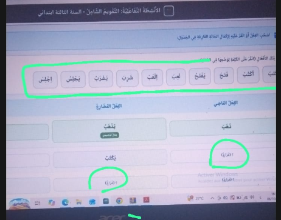
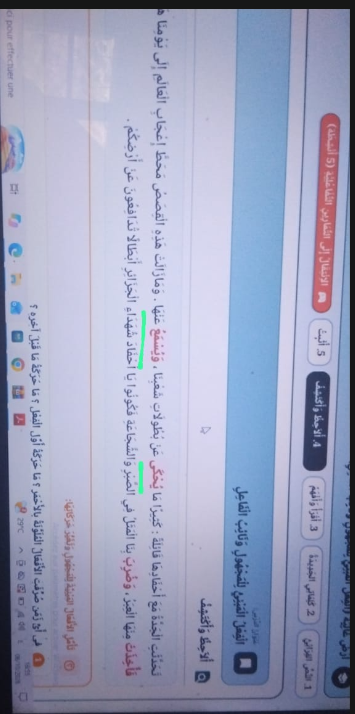

# 25 [COMPLETED]: medium

في السنة الثالثة إبتدائي التقويم الشامل النشاط 3 , في هاد النشاط أترك مكان الفعل فارغ لا نضع اقتراح، مكان الفعل نخلي فيه نقاط وهو يختار من الكلمات الموجودة

# 26 [COMPLETED]: medium

في السنة الثالثة إبتدائي التقويم الشامل النشاط 6

هنا الافعال المقترحة تحذف كلها، ومكان الفراغ هذاك نخلوه مساحة باه يكتب التلميذ، يعني نشاط يعتمد على ما يكتب التلميذ وليس نشاط سحب وإفلات

# 27 [COMPLETED]: medium

السنة الرابعة إبتدائي الدرس الأول تاجماعت النشاط 5 ,  الفقرة خليها نص واحد ميكونش مقسم، لانو التقسيم بهاذي الطريقة وكأننا قدمنا للتلميذ إجابة على السؤال

# 28 [COMPLETED]: medium

السنة الرابعة الدرس الثاني الفاعل النشاط 4 أزل جميع المقترحات و أترك التلميذ يكتب و يوجد زر تحقق و زر عرض إجابة نمودجية من أجل كل خيار 

# 29 [COMPLETED]: medium

في السنة الرابعة التقويم الشامل النشاط 6, في هذا النشاط التلميذ يستخرج الجملة الفعلية، لكن العناصر الاخرى الفاعل والمفعول به يستخرجها التلميذ وحدو ويكتبها فالجدول، كي يستخرج للجملة الفعلية العناصر الأخرى ما تظهرش تلقائيا وانما يزيد يستخرجهم من الجملة

# 30 [COMPLETED]: medium

السنة الخامسة التقويم الشامل النشاط 5 , الجمل المكتوبة نعوضوها بهذه الجمل مكانها: " كتب التلميذ الدرس، تُزرع الأشجار، فُتح الباب، جاء المعلم، يرسم الفنان لوحة، قُطفت الأزهار".

# 31 [COMPLETED]: medium

السنة الخامسة في الدرس الأول في ألاحظ و أكتشف حروف النص أو النواصب ضعها باللون الأخضر 

# 32 [COMPLETED]: medium

السنة الخامسة في الدرس الثاني جوازم الفعل المضارع في ألاحظ و أكتشف : 
   الأمر نفسه هنا الحروف ( لم ولا) يكتبها بلون والفعل لي بعدها يكتبها بلون آخر الفعل باللون الأحمر و الجازم أو الحرف او الكلمة الجازمة باللون الأخضر 

# 33 [COMPLETED]: medium

في السنة الخامسة الدرس الثالث أرض غالية في ألاحظ و أكتشف , الأفعال المسطرة  تكتب باللون بالأخضر:
    

# 34: medium

السنة الخامسة الدرس الثاني النشاط التفاعلي الرابع, في هاذ النشاط كيما فالنشاطات الأخرى نترك الفراغ والتلميذ يستخرج كل العناصر المطلوبة من النص ويكتب الإجابة لوحده

# 35: medium

# 36:

# 37:

# 38:

# 39:

# 40: