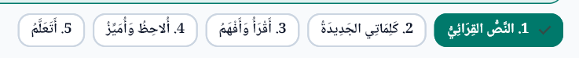

# 14: high  [COMPLETED]
    docs/أنشطة تقويمية شاملة السنة الثالثة ابتدائي.docx 
    هنا أريد أن تضيف التقيوم الشامل بحسب التوثيق المكتور و المسجل هنا في هذا الملف داخل البرنامج في الثالثة 
    
# 15:  high [COMPLETED]

    نفس الشيء مع هذا 
    docs/أنشطة تقويمية شاملة السنة الرابعة ابتدائي.docx
    
    
# 16: high [COMPLETED]

نفس الشيء مع هذا docs/أنشطة تقويمية شاملة السنة الخامسة ابتدائي.docx

# 17: high [COMPLETED]

الإنتقال إلى التمارين التفاعلية في كل صفحات الدروس في جميع السنوات حاليا هي توجد في آخر الصفحات أزل ذلك الزر من جميع الصفحات ليصبح في نفس سطر العناوين فوق 

يكون بعدهم مباشرة في جميع السنوات و الدروس 

# 18: medium [COMPLETED]

في ألاحظ و أميز يجب أن يكون فوقها دائما عنوان الدرس و بخط غليظ مشكول لكل درس 

# 19: medium [COMPLETED]

في السنة الثالثة  الدرس الأول الفعل الماضيي النشاط التفاعلي الخامس المتعلق بالصور أزل جميع الأوصاف الموجودة المتعلقة بالصورة تبقى فقط الصورة و الطفل هو يستنتج المعنى وحده 

# 20 [COMPLETED]:

في السنة الثالثة الفعل الأمر النشاط الثالث غير الأفعال الموجودة التي يجب تصنيفها إلى: 
    "كتب، يرسم، قف، ارجع، سمع، يضحك، نام، يعمل، العب"  و لا تنسا الشكل 

# 21 [COMPLETED]:

في السنة الرابعة درس الفاعل الدرس الثاني جزء الأنشطة التفاعلية النشاط الخامس :
    الأمر نفسه هنا فالأنشطة تاع النصوص، التلميذ يستخرج الفعل كيما فالصورة، لكن في الجدول الإعراب مايظهرش تلقائيا يظهر فقط الفعل او الفاعل ..... بصح الإعراب  التلميذ هو لي يكتبو ومبعد نتأكدو من الاجابة والأخطاء لي يديرها التلميذ
    الإعراب يكتب من قبل التلميذ يوجد قائمة بالأجزاء الموجودة في الإعراب نفسه و أجزاء أخرى ثانوية من أجل التشتيت يستخدمها التلميذ من أجل إكمال الإعراب 

# 22 [COMPLETED]:

في السنة الرابعة الدرس الأول النشاط الخامس في الأنشطة التفاعلية:
    في هاد النشاط المفروض لما يضغط التلميذ على الجملة الفعلية تحدد باللون الأخضر لكن هنا بقات هكذا بدون تغيير، وتاني كي تكون الإجابة صحيحة تظهر الجمل كيما فالصورة، يعني نخلوها مخفية حتى يجاوب التلميذ إجابة صحيحة باه تظهر، واذا غلط " حاول مرة أخرى" 

# 23 [COMPLETED]:

في السنة الخامسة الدرس الثالث النشاط التفاعلي الثالث : 
    في هاذ النشاط السؤال يكون " حول الجملة من المبني للمعلوم إلى المبني للمجهول" فقط بدون إضافة، وأيضا ما نقدموش للتلميذ مقترحات للإجابة وهو يرتبها وانما نخلي الفراغ لي يكتب فيه فقط، وبعد ما يكتب التطبيق يصححلو الأخطاء اللغوية والشكلية والإملائية في الوقت نفسه و الأمر نفسه في هاذ النشاط 5 نترك الجدول فارغ والتلميذ يكتب الإجابة المناسبة

# 24:

في السنة الخامسة الدرس الثاني النشاط التفاعلي 5 :
    الأفعال المقترحة في هذا النشاط تستبدل بالأفعال: "كي ينجح، يعملان، لم يسمعو، يكتب، لم يسْعَ، لن يرمي، لا تلعب، لن يهملوا، يشاركون" مع التشكيل  ,نفس الشي في السنة الخامسة الدرس الأول النشاط الخامس نترك الجدول فارغ والتلميذ يكتب بنفسه آداة النصب وعلامة الإعراب
    

# 25:

# 26:

# 27:

# 28:

# 29:

# 30:

# 31:

# 32:

# 33:

# 34:

# 35:

# 36:

# 37:

# 38:

# 39:

# 40: